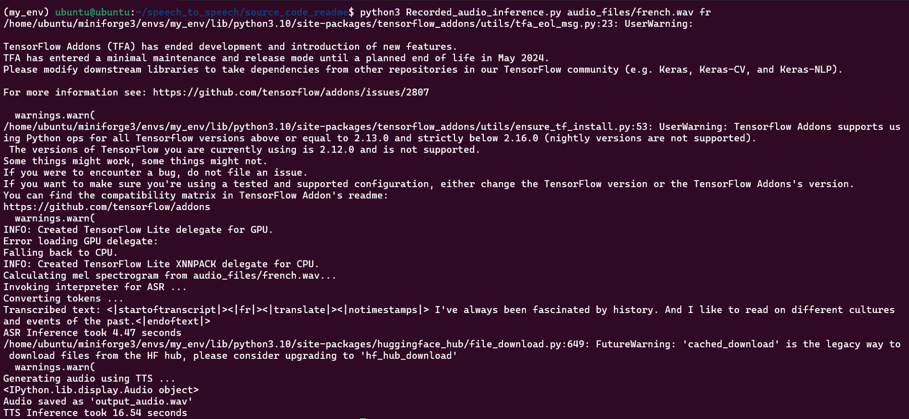
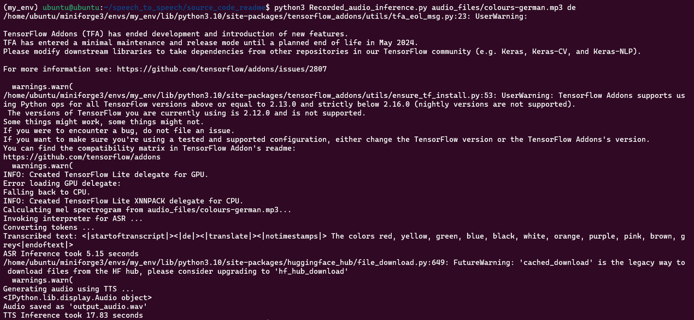

## Introduction
This project focuses on developing a real-time speech-to-speech recognition system that leverages OpenAI's Whisper model for text-to-speech (TTS) conversion and the FastSpeech model for speech-to-text (STT) conversion. The system is tested with Recorded audio input in two languages, German and French, transcribed to English, on the Qualcomm RB3 Gen2 platform. The project explores the potential of combining cutting-edge models in natural language processing (NLP) and speech recognition technologies to build a high-performance, multilingual solution for real-time speech processing. Specifically, it excels in long-form transcription, capable of accurately transcribing audio clips up to 30 seconds long. 

## Prerequisites 
 
- Ubuntu 18.04  

- Conda Environment 

- TFLite 

- Python 3.10

- RB3 Gen2
 
### Whisper_Base_En(STT) and FastSpeech(TTS) Tflite Models Inference on RB3 Gen2  
## Steps to Execute:  
1. Install Conda on wsl2 by using the below given link. 
https://thesecmaster.com/step-by-step-guide-to-install-conda-on-ubuntu-linux/ 

- After Installation, create the conda environment by using the given commands. 
```sh 
    $ conda create --name <env_name> python=3.10
```
- To check the conda environment list 
```sh 
    $ conda env list 
```
- To activate conda environment 
```sh
    $ conda activate “env_name” 
```
2. Clone the repository into RB3 Gen2. 
```sh
    $ cd /data
    $ git clone <source repository> 
    $ cd <source repository>/
```    
3. Refer the link, Execute the cell to download the whisper_base.tflite model and save it in models folder: https://github.com/usefulsensors/openai-whisper/blob/main/notebooks/whisper_base_tflite_model.ipynb.

4. (Optional) Refer the link, Execute the cell to download the fastspeech_quant.tflite model and save it in models folder: https://github.com/TensorSpeech/TensorFlowTTS/blob/master/notebooks/TensorFlowTTS_FastSpeech_with_TFLite.ipynb 

5. Install the required dependencies for rb3 Gen2 to run the tflite inference.
```sh
    $ pip install -r requirements.txt
```

6. Speech To Speech  Tflite model inference with Recorded Audio file as input on RB3 Gen2. 
    1. French To French 
   
    ```sh
        $ python3 Recorded_audio_inference.py audio_files/french.wav fr 
    ```
     

    2. German To German 
    ```sh
        $ python3 Recorded_audio_inference.py audio_files/colours-german.mp3 de 
    ```
     


7. Speech (French/German) to Speech (English) transcribed audio saved as output_audio.wav    
--- 
- Open issuse :
    The model is currently running on the CPU. We are working to enable GPU and DSP runtime for this model.